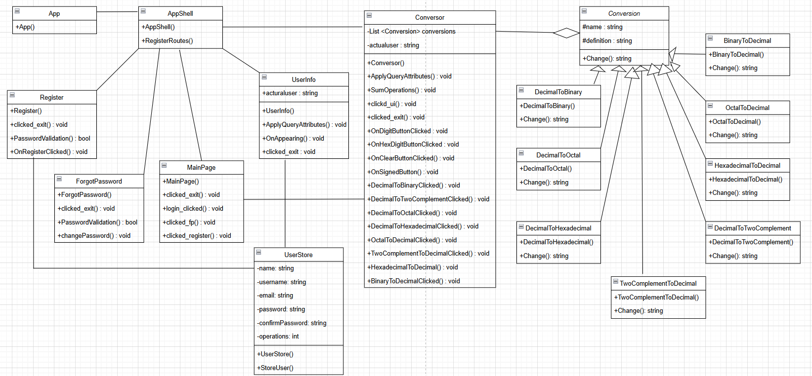

# oop_pw2_ext_2425
This repository is the base structure for Practice 2 of the extraordinary session of Object-Oriented Programming.

> **UNIVERSIDAD** **FRANCISCO** **DE** **VITORIA**
>
> **ESCUELA** **POLITÉCNICA** **SUPERIOR**
>
> **Object** **Oriented** **Programming** 2ºA, Informatic Engineering
>
> **Practical** **Work** **2** **Extraordinary**
>
> **CALCULATOR** **CONVERTOR**
>
> Ángela Pérez López

INDEX

1 I - INTRODUCTION 3 II - DESCRIPTION 3 III - UML DIAGRAM 4 IV -
PROBLEMS 7 V - CONCLUSION 8

**I** **-** **INTRODUCTION**

In this document I will explain the process of my project development.
First to mention that this is an improvement of my Ordinary Practical
Work. I had to create a program where users can register, login and
reset passwords. Once the user is logged in, it has the opportunity of
using the binary, decimal, octal and hexadecimal calculator.

Here, in this document, I will explain the description of the program
with the UML diagram, followed the problems and difficulties and a
conclusion to summarize my learnings with this work.

**II** **-** **DESCRIPTION**

For the part of the calculator I used the weekly activities that the
teacher published for us to work on. The program is divided into two
main parts, the *“xalm.”* files (for the interfaces) and the
*“xaml.cs.”* files (for the program behavior and functions). These are
the following sections:

**xaml.** **files**

> \- Register → displays the register interface - MainPage → displays
> the login interface
>
> \- ForgotPassword → displays an interface where the user can change
> their password - Conversor → displays the
> decimal/binary/hexadecimal/octal convertor interface
>
> \- UserInfo → displays an interface where the user can see the actual
> user´s information

**xaml.cs.** **files**

> \- <u>Register</u>

On this file the user is able to register itself with the name,
username, email and a password (which the user has to write twice to
confirm it).

This code contains validation for the registration. This includes that
all the fields are filled, the name and username must be different, the
password must contain 8 characters, a symbol, an upper and a lower
letter and a number, password and confirm password must be the same, the
email must contain a “@”, that the username does not exist and that the
check box for the policy acceptance is checked.

I also added buttons for navigation and once all the information is
correct, the user will click the “register button” which will save the
user into the *“user.csv”* creating a new user.

> \- <u>MainPage</u>

To be able to access the Conversor page, the user had to put the name
and username. This program confirms that the username and password
entered match and have been registered. Also this page gives the user
the option to go to the Forgot Password page and Register page.

> \- <u>ForgotPassword</u>

This program gives the user an opportunity to change their password.
Once the user adds a username, the program confirms it exists and then
the user writes a new password and a confirmation for the new password
which also follows the parameters for the password

validation. Once the user clicks the button, the new password gets saved
into the *“user.csv”* file by updating the password field. The user is
then automatically taken to the Main page.

> \- <u>Conversor</u>

This page allows the user to input a number (decimal, binary,
hexadecimal or octal) and can convert it into another number system. I
added *SumOperations()* that increments the number of operations done
every time the user completes a conversion and then updates and saves
the data inside the *“user.csv”* file.

I also added *ListInfo()* where I save every input, output and
conversion type from every operation the user does in the converter,
this is then saved in the *“operations.csv”* file with the username of
the actual user.

It contains manual validation for the correct type of data and that
there has been data inputted. It has the *“IQueryAtributable”* to pass
the information while navigating.

This page has the link to access the user information page. This page
also gives the user the chance to log out or to see the user's
information.

> \- <u>UserInfo</u>

The purpose of this file is to display the users information that is
read from the *“user.csv”* and *“operations.csv”*. It contains the
*OnAppearing()* method that makes sure to find the corresponding
information of the actual user. Also declared with the
*“IQueryAtributable”* that allows the page to receive the parameters as
the user navigates. From this page the user can navigate back to the
conversor page or log out, taking them to the main page.

I also added a single “cs”. file called *“UserStore.cs”* that is not
connected to any “xaml” file. The purpose of this file is saving the
user information inside the *“user.csv”* and the *“operation.csv”* file.

**csv.** **files**

> \- <u>user.csv</u> → stores the user´s name, username, password, email
> and number of operations done
>
> \- <u>operations.csv</u> → stores the user's username, input, output
> and conversion type. Every operation is stored in a different line.

**III** **-** **UML** **DIAGRAM**

This following diagram is the UML (unified modelling language) diagram
of the program.

**IV** **-** **PROBLEMS**

First, I will start by mentioning the problems I had in my ordinary
practical work. The main problem I had while doing this practical work,
was figuring out how MAUI works, because it is an extension that I never
worked with. therefore i had to stay a few days trying out, and failing,
until I managed to understand it fully.

While doing the work, the other main problem that i had was trying to
find a way of joining the Activity 5 to the practical, recycling as much
code as I could.

In this new practical work we had to add a few more operations like
adding a function that displayed the list of the operations the current
user has done in the calculator. For me at the beginning this was a
challenge because I couldn't find a way of doing it and initially I
added the attributes *“input”*, *“convert* *type”* and *“output”* in the
*“users.csv”*. Then, I realized that it would be so much easier if I
managed to create a new csv. I created the *“operations.csv”* where I
stored the user's username, input, output and conversion type of every
operation.

Lastly, my main problem was figuring out how to not have the same error
that my practical work had once you run it, so I had to change different
parts of my programs like adding try catches and avoiding navigation
inside loops.

**V** **-** **CONCLUSION**

To develop this program I used my knowledge and tools from the first
practical work and the weekly activities and activity workouts.Thanks to
this individual practical work, I can acquire more practice for the
final exam. This is a great tool to implement all that we thought
throughout the course. Also, I learnt how to program using the MAUI
extension, which is a new skill for my future.

In conclusion this work helped learn new lessons and prepare me for
future projects, apart from teaching me a new way of coding.
